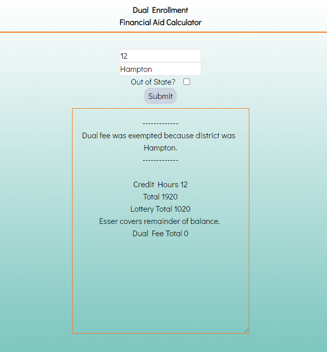

## TLC Tutition Assitance Cacluator

  

This program allows you to input a student's credit hours, 
as well as the following counties: Hampton, Jasper, Polaris, as well as "Homeschool", "Private", or "Other". 

There is also a radio button that can be selected to denote that
the student is "out of state".

> inputting "Beaufort" will also allow you to enter the students tuition total after you initially submit, in order to check to see if it's correct.

## INSTALLATION
The calcuator is contained in a single HTML file, which can be downloaded by clicking "TCL Tuition Assitance Calcultor"
under "releases" to the right of this page, then clicking "TCL_Tuition_Assistance_Calculator.html" under "Assets".
